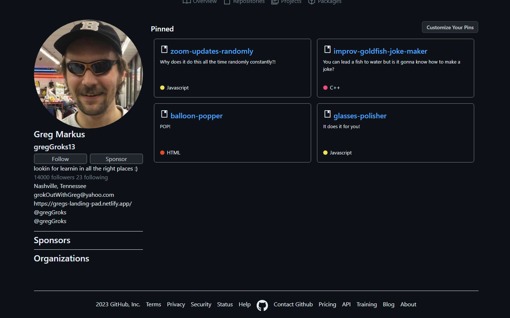
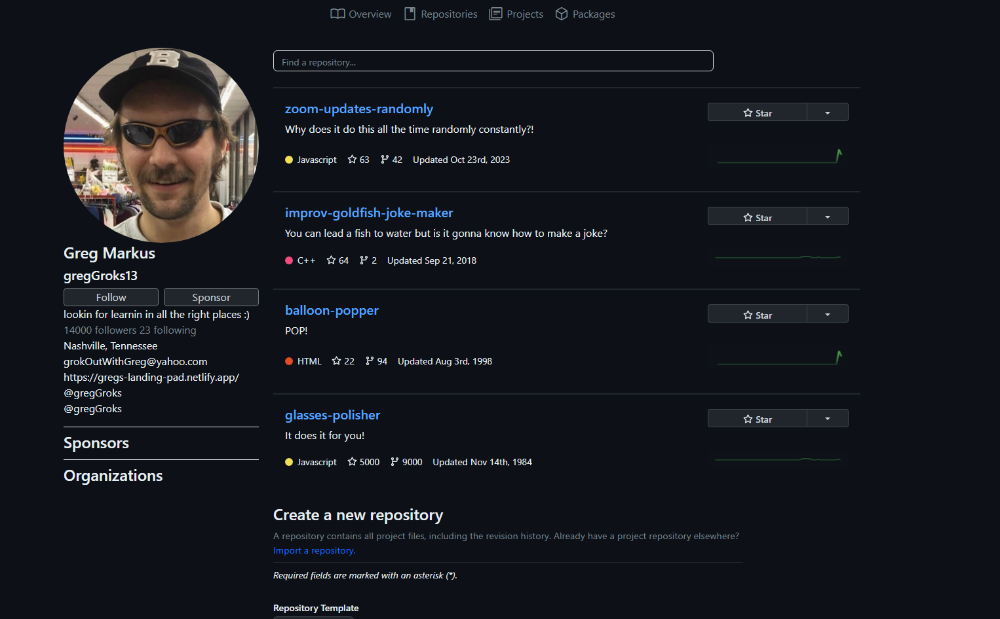

# Gitsub  
<!--  -->
<!-- update the netlify badge above with your own badge that you can find at netlify under settings/general#status-badges -->

Gitsub is a Github clone created from scratch.

## About the User 
- The ideal user for this application is a developer
- They need a place to organize and store code and projects
- The problem this app solves for the user is it allows a place to store, organize and collaborate with code.

## Features 
- This app features 4 different pages that allow organization. These pages are as follows:
- Overview page: this page has an area for pinned repositories and a form to pin them
- Repository page: this page has a form for creating repos and then a container for rendering created repos
- Projects page: this page has a form for creating projects and a container for rendering created repos
- Packages page: this page has a form for creating packages and a container for rendering created packages

- Each page has a profile rendered on the side, a Nav bar that allows navigation between pages, and a footer.

## Video Walkthrough of Gitsub <!-- A loom link is sufficient -->

## Relevant Links <!-- Link to all the things that are required outside of the ones that have their own section -->
- [Check out the deployed site](#your-link)
- [Project Board](https://github.com/nss-evening-cohort-24/gitsub-team-3/issues)

## Project Screenshots 
- 
- 
- 
- 

## Contributors
- Keana Cobarde [ https://github.com/keanacobarde ]
- Greg Markus [ https://github.com/GregM1992 ]
- Ryan Shore [ https://github.com/mshorecode ]
- Nicholas Davidson [ https://github.com/ndswimming92 ]
